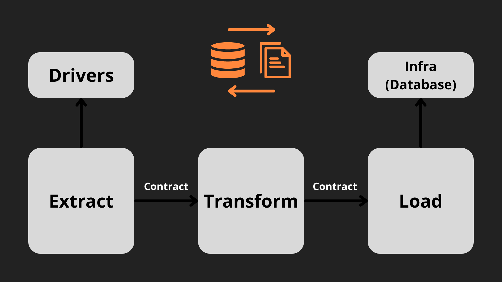
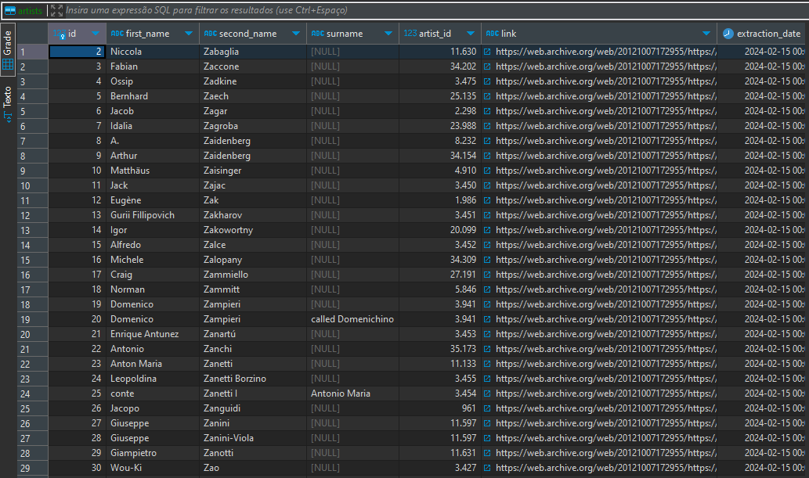

# Extract, Transform and Load (ETL)

## Índice
- [Objetivo](#objetivo)
- [Website](#website)
- [Dados](#dados)
- [Drivers](#drivers)
- [Extração](#extração)
- [Transformação](#transformação)
- [Carregamento](#carregamento)
- [Como Usar](#como-usar)
- [Dependências](#dependências)

## Objetivo:
* Este projeto tem como objetivo a extração, transformação e carregamento de dados de um website HTML informativo sobre artistas.
* Diagrama do projeto:


## Website
* Abaixo está uma foto da interface do site. O quadrante selecionado (azul) representa a parte do website destinada à extração.


## Dados 

| Nome da Variável            | Descrição                                                       |
|-----------------------------|-----------------------------------------------------------------|
| artist_id                   | Dado retirado do link, representa o id (numeração representativa) do artista. |
| first_name                | Primeiro nome do artista. |
| second_name                        | Segundo nome do artista (Sobrenome) |
| surname                | Apelido do artista (variável não obrigatória). |
| link                         | Link para a biografia completa do artista. |

## Drivers
* Http Requester: Utilizar a url do website para fazer uma requisição HTTP utilizando a lib Requests e obtém uma resposta (status code e conteúdo do HTML);
* Html Collector: Foi utilizado o BeautifulSoup para realizar HTML parser e acessar o conteúdo de uma classe específica HTML ("BodyText") e obter os valores de uma tag <a>. Aqui é retornado o nome do artista e o seu link.

## Extração
* Utiliza dos dados provenientes do Http Resquester e HTML Collector para extração; 
* Retorno: Conteúdo (raw_information_content) e Data da Extração (extraction_date)

## Transformação
* Com o retorno raw_information_content, faz a separação das variáveis necessárias interagindo com as strings;

## Carregamento
* Em "Infra/database_connector" é feito o script para conexão com o banco de dados local utilizando DBeaver e MySQL;
* Em "Infra/database_repository" é feito o script para query de criação do database;
* A etapa de carregamento une os itens anteriores para criação do database e inserção de dados com a query criada.

* Resultado:


## Como Usar

* Instale em sua máquina as dependências no tópico "Dependências";
* Crie um localhost no DBeaver ou em outro SGBD com MySQL (caso seja o DBeaver instale o XAMPP para criar um servidor local);
* Abra o terminal e a acesse o arquivo "`main_pipeline.py`" e digite:
```bash
python main_pipeline.py
```

## Dependências
* Crie uma venv no Windows: 
```bash
python -m venv venv 
```
* Acesse a pasta da venv:
```bash
venv\Scripts\activate
```

* Você pode conferir todas as depências no arquivo "requirements.txt" ou basta instalar com os código abaixo:

```bash
pip install pandas
```
```bash
pip install numpy
```
```bash
pip install beautifulsoup4
```
```bash
pip install mysql-connector-python
```
```bash
pip install pylint
```
```bash
pip install pytest
```
```bash
pip install PyYAML
```
```bash
pip install requests
```
```bash
pip install requests
```
