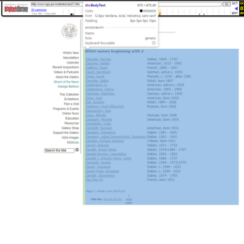

# Análise de empresa indiana

## Índice
- [Contexto](#contexto)
- [Dados](#dados)
- [Como Usar](#como-usar)
- [Dependências](#dependências)
- [Conclusões](#conclusões)

## Contexto:
Este projeto tem como objetivo a extração, transformação e carregamento de dados de um website HTML informativo sobre artistas.




## Dados Extraídos

| Nome da Variável            | Descrição                                                       |
|-----------------------------|-----------------------------------------------------------------|
| artist_id                   | Dado retirado do link do artista, representa o id (numeração representativa) do artista. |
| first_name                | Primeiro nome do artista. |
| second_name                        | Segundo nome do artista (Sobrenome) |
| surname                | Apelido do artista (variável não obrigatória). |
| link                         | Link para a biografia completa do artista. |


## Como Usar

* Instale em sua máquina o Anaconda Navigator. Link: https://www.anaconda.com/download ;
* Abra o Anaconda e Instale o Jupyter Notebook na versão 7.0.6,
* Baixe os arquivos deste repositórios nomeados como: CODIGO_INDIA_CIENCIA_DADOS.ipynb, conjunto_de_dados_de_funcionarios.csv, admission_dataset.csv ;
* Coloque-os juntos na mesma pasta e abra o notebook que contém o código.

## Dependências
Execute em células separadas os seguintes comandos:

```bash
pip install pandas
```
```bash
pip install numpy
```
```bash
pip install matplotlib
```
```bash
pip install seaborn
```
```bash
pip install plotly
```

## Conclusões
Acesse os links abaixo e confira as conclusões obtidas:

* Machine Learning: https://www.canva.com/design/DAF05y4x2DE/33mN0cQOjQE9lDz-nJG9bA/edit?utm_content=DAF05y4x2DE&utm_campaign=designshare&utm_medium=link2&utm_source=sharebutton ;
* Visualização de dados: https://sway.office.com/h8R6yu7pg6OLRTvE?ref=Link ;
* Visualização de dados: https://sway.office.com/Pt82OMEPCizwLHb9?ref=Link&loc=mysways .
