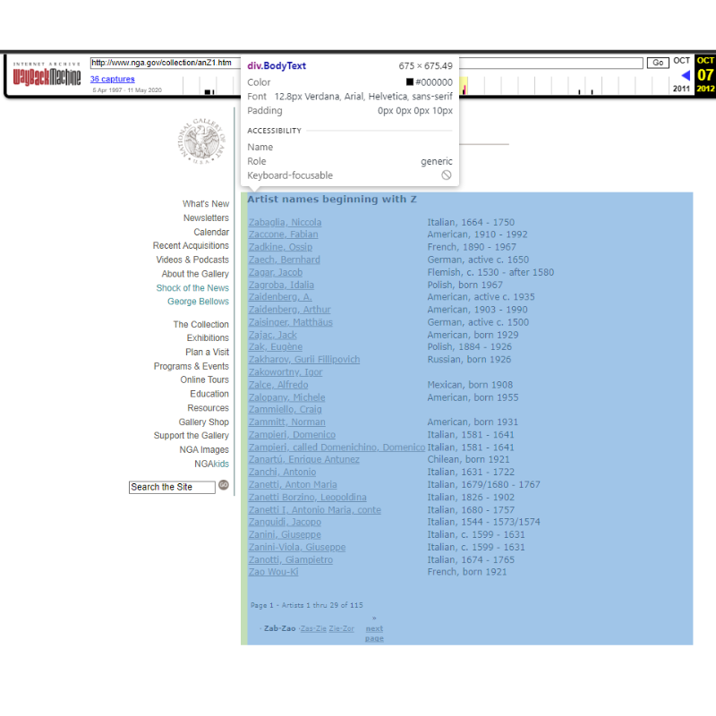

# Extract, Transform and Load (ETL)

## Índice
- [Contexto](#contexto)
- [Dados](#dados)
- [Drivers](#drivers)
- [Extração](#extração)
- [Transformação](#transformação)
- [Carregamento](#carregamento)
- [Como Usar](#como-usar)
- [Dependências](#dependências)
- [Conclusões](#conclusões)

## Contexto:
* Este projeto tem como objetivo a extração, transformação e carregamento de dados de um website HTML informativo sobre artistas.
* Abaixo etá uma foto da interface do site. O quadrante selecionado (azul) representa a parte do website destinada à extração.




## Dados 

| Nome da Variável            | Descrição                                                       |
|-----------------------------|-----------------------------------------------------------------|
| artist_id                   | Dado retirado do link, representa o id (numeração representativa) do artista. |
| first_name                | Primeiro nome do artista. |
| second_name                        | Segundo nome do artista (Sobrenome) |
| surname                | Apelido do artista (variável não obrigatória). |
| link                         | Link para a biografia completa do artista. |

## Drivers
* Http Requester: Utilizar a url do website para fazer uma requisição HTTP utilizando a lib Requests e obtém uma resposta (status code e conteúdo do HTML);
* Html Collector: Foi utilizado o BeautifulSoup para realizar HTML parser e acessar o conteúdo de uma classe específica HTML ("BodyText") e obter os valores de uma tag <a>. Aqui é retornado o nome do artista e o seu link.

## Extração
* Utiliza dos dados provenientes do Http Resquester e HTML Collector para extração; 
* Retorno: Conteúdo (raw_information_content) e Data da Extração (extraction_date)

## Transformação
* Com o retorno raw_information_content, faz a separação das variáveis necessárias interagindo com as strings;

## Carregamento
* Em "Infra/database_connector" é feito o script para conexão com o banco de dados local utilizando DBeaver e MySQL;
* Em "Infra/database_repository" é feito o script para query de criação do database;
* A etapa de carregamento une os itens anteriores para criação do database e inserção de dados com a query criada.


## Como Usar

* Instale em sua máquina o Anaconda Navigator. Link: https://www.anaconda.com/download ;
* Abra o Anaconda e Instale o Jupyter Notebook na versão 7.0.6,
* Baixe os arquivos deste repositórios nomeados como: CODIGO_INDIA_CIENCIA_DADOS.ipynb, conjunto_de_dados_de_funcionarios.csv, admission_dataset.csv ;
* Coloque-os juntos na mesma pasta e abra o notebook que contém o código.

## Dependências
Você pode conferir todas as depências no arquivo "requirements.txt" ou basta instalar com o código abaixo:

```bash
pip install pandas
```
```bash
pip install numpy
```
```bash
pip install matplotlib
```
```bash
pip install seaborn
```
```bash
pip install plotly
```

## Conclusões
Acesse os links abaixo e confira as conclusões obtidas:

* Machine Learning: https://www.canva.com/design/DAF05y4x2DE/33mN0cQOjQE9lDz-nJG9bA/edit?utm_content=DAF05y4x2DE&utm_campaign=designshare&utm_medium=link2&utm_source=sharebutton ;
* Visualização de dados: https://sway.office.com/h8R6yu7pg6OLRTvE?ref=Link ;
* Visualização de dados: https://sway.office.com/Pt82OMEPCizwLHb9?ref=Link&loc=mysways .
